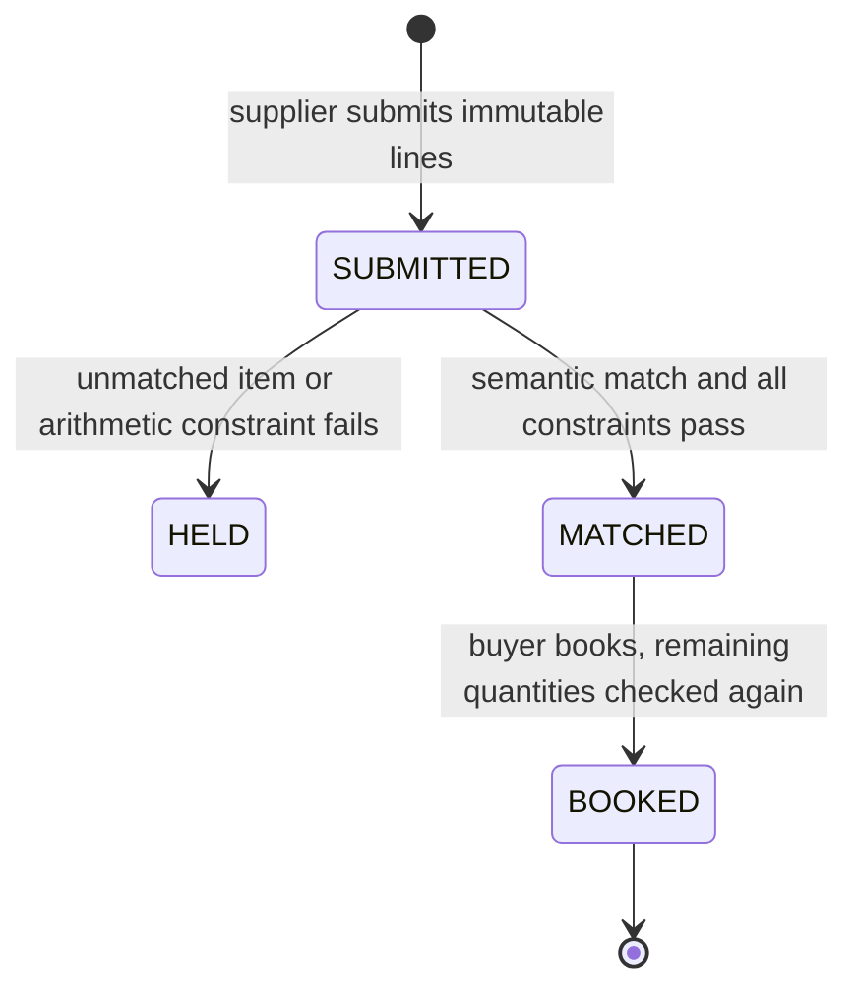

# InvoiceMatch

A standalone GenLayer Intelligent Contract for reconciling invoice lines against
an immutable purchase order. It is useful when two parties use different wording
for the same service, but an approval must still obey exact commercial limits.

An LLM can recognize that two descriptions refer to the same item. It must not
decide whether an extra quantity or a changed price is acceptable. InvoiceMatch
keeps these responsibilities separate.

## State and roles

The deploying account is the buyer. The buyer registers an order, including a
supplier account, a currency, and up to eight lines. The registered supplier
submits invoices. The buyer requests consensus review and explicitly books a
matched invoice. Other accounts cannot submit or approve it.



`MATCHED` does not reserve any quantity. If two invoices are reviewed against the
same remaining quantity, booking the first can make the second unbookable.
`book_invoice` recomputes the remaining quantity and changes both the order ledger
and invoice status in one write. A stale review cannot overbook the order.

## Consensus

The leader receives immutable order and invoice line copies and returns a mapping
for every invoice line. Each validator independently runs the matching task
against those same inputs. A custom `run_nondet_unsafe` validator compares every
`invoice_line -> order_line` pair exactly. Free-text explanations may differ.
Malformed, missing, repeated, or unknown line IDs fail validation.

An ambiguous item must map to an empty string and be held. The prompt explicitly
distinguishes identity and scope from price, rejects substitute products and unit
conversions, and treats invoice descriptions as data rather than instructions.
This reduces prompt-injection risk; it does not eliminate model error.

After consensus, ordinary Python checks:

* Invoice currency equals the order currency.
* Units and unit prices equal the registered values, with no tolerance.
* The supplied total equals the sum of quantity times unit price.
* All invoice lines are covered and matched.
* Quantities mapped to the same order line are aggregated before comparison.
* Booked quantity plus proposed quantity does not exceed the order quantity.

Amounts use integer minor units. Quantities are whole units; fractional quantities,
taxes, discounts, shipping charges, and currency conversion are intentionally
unsupported. An invoice must be expressed as supported line items before submission.

## Try the contract

Deploy [contract.py](contract.py) in GenLayer Studio with no constructor arguments.
Use two accounts: a buyer to deploy and create the order, and a supplier whose
address replaces `SUPPLIER_ADDRESS`. All sample data below is fictional.

Buyer calls `create_order`:

```text
order_id: PO-DOCS-01
supplier: SUPPLIER_ADDRESS
currency: USD
order_lines_json:
[{"id":"P1","description":"Editorial review of API documentation, September","unit":"hour","quantity":3,"unit_price_minor":5000}]
```

Supplier calls `submit_invoice`:

```text
order_id: PO-DOCS-01
invoice_id: INV-DOCS-01
currency: USD
total_minor: 10000
invoice_lines_json:
[{"id":"I1","description":"September API documentation editorial review","unit":"hour","quantity":2,"unit_price_minor":5000}]
```

Buyer calls `review_invoice(SUPPLIER_ADDRESS, "INV-DOCS-01")`. Wait for network
finality and read `get_state()`. If consensus matched the descriptions and status
is `MATCHED`, call `book_invoice` with the same arguments. The remaining quantity
becomes one hour; the invoice gains a `record_hash` and `BOOKED` status.

To test the race, submit and review a second two-hour invoice before booking the
first. Both may be `MATCHED`; after the first booking the second must revert with
`BOOKING_CONFLICT:QUANTITY_EXCEEDED:P1`. No second booking is recorded.

## API

| Method | Caller | Effect |
| --- | --- | --- |
| `create_order(id, supplier, currency, lines_json)` | Buyer | Lock order terms |
| `submit_invoice(order_id, invoice_id, currency, total_minor, lines_json)` | Registered supplier | Append immutable invoice |
| `review_invoice(supplier, invoice_id)` | Buyer | Semantic consensus, then deterministic checks |
| `book_invoice(supplier, invoice_id)` | Buyer | Atomically consume remaining quantity and record booking |
| `get_state()` | Anyone | JSON order and invoice ledger |

## Limits and trust

An invoice ID is unique per supplier across this deployment, including different
orders. IDs are case-sensitive. This prevents replay of that ID, not a dishonest
supplier renaming a real invoice. Quantity limits still constrain bookings per
order. There is no global registry across separate deployments.

Order and invoice entries cannot be edited or deleted. A held invoice is final;
a corrected commercial document needs a new invoice ID. There is no hidden
override or model reroll for a reviewed invoice. Transient failed transactions
can be retried because they do not commit a review.

Bounds: 32 orders, 128 invoices, eight lines per order/invoice, 600 UTF-8 bytes per
description, quantities up to 1,000,000, unit prices up to 1,000,000,000 minor units.
Storage is a bounded JSON ledger intended for reference deployments, not a large
enterprise accounting database.

Descriptions, reasons, and invoice data are public contract state. Use public or
synthetic data. The contract does not authenticate a paper invoice, confirm that
a service occurred, pay a supplier, or post to external accounting software.
The record hash is a content digest; it is not a separate signature or proof of
payment. Reasons are explanatory text, not exact-agreement consensus fields.

## Live Studionet deployment

Contract: [0x1a1C897efBCd0BA6a51222947001180d461278a3](https://explorer-studio.genlayer.com/address/0x1a1C897efBCd0BA6a51222947001180d461278a3)

[Open in Studio](https://studio.genlayer.com/?import-contract=0x1a1C897efBCd0BA6a51222947001180d461278a3) · [Deployment transaction](https://explorer-studio.genlayer.com/tx/0x5d46d777ff074788d586e4740db7d39526bad51768ec01ac6dfb8b7c48591b0f)

Verified on 27 September 2026 UTC (28 September in Istanbul), chain 61999.
The deployed source was retrieved and compared byte for byte with `contract.py`.
All four documented sample writes reached `FINALIZED`, `MAJORITY_AGREE`, and
`SUCCESS` with full consensus. Separate disposable test accounts and fictional
inputs were used; no user wallet or real funds were used.

Observed result: `INV-DOCS-01` is `BOOKED`, with two of three ordered hours consumed
and a stored record hash.

Exact transaction IDs, inputs and final state are in [live-evidence.json](../live-evidence.json).
To try writes yourself, deploy a fresh instance under your own buyer account.
The shared instance is a public reference, not an account delegation.

## Verification

[25 Direct Mode tests](tests/test_invoice.py) cover booking races, replay across
orders, aggregate quantities, arithmetic mismatches, role boundaries, malformed
model results, numeric bounds, and independent validator disagreement.
See [verification details](../VERIFICATION.md) for executed commands and limits.
